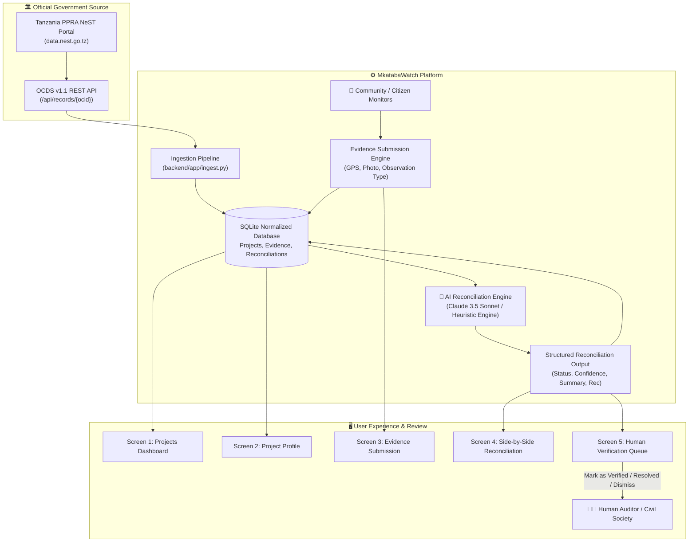

# MkatabaWatch 🇹🇿 — Public Contracts, Public Evidence

> **Connecting official Tanzanian public procurement records with citizen and community monitor evidence, powered by AI reconciliation.**

MkatabaWatch is a proof-of-concept civic technology platform that bridges the gap between official government procurement data and on-the-ground reality in Tanzania. It ingests verified Open Contracting Data Standard (OCDS) releases from Tanzania's Public Procurement Regulatory Authority (PPRA) National e-Procurement System (NeST) portal, enables community monitors to submit geotagged photographic and observational field evidence, and applies an AI reconciliation layer to flag discrepancies for independent human verification.

---

## 🏛️ Hackathon Track
**Transparency & Accountability**

---

## 🔍 Data Source: Live Reality vs. Seeded Demo Data

We strictly abide by open-data honesty and integrity: **Never fabricate official procurement records.**

| Component | Provenance & Source | Verification Details |
| :--- | :---: | :--- |
| **Official Public Contracts** | **100% REAL & LIVE** | Extracted from the **Tanzania PPRA National e-Procurement System (NeST)** Open Contracting Data Portal at [`https://data.nest.go.tz`](https://data.nest.go.tz) via its live OCDS v1.1 REST API (`https://nest.go.tz/gateway/nest-data-portal-api/api/records/{ocid}`). All project titles, buyer names, contractor legal entities, dates, and contract values in TZS are authentic public records. |
| **Community Evidence Submissions** | **Seeded for Demo** | The 15 initial field reports (photos, GPS coordinates, descriptions) are realistic demonstrations created to showcase the reconciliation workflow. Every seeded record is explicitly marked `is_seeded_demo_data = TRUE` and displays a visible **"Demo Data"** badge in the UI. New submissions created through Screen 3 are stored as genuine community records. |
| **AI Reconciliation Layer** | **AI-Generated Analysis** | Synthesizes official contractual commitments against submitted field observations. It operates under strict anti-accusation prompt constraints: it **never accuses anyone of corruption or illegal conduct**, but surfaces factual inconsistencies for independent human review. |

*(Detailed endpoint documentation, reverse-engineering findings, and the 10 cataloged projects are recorded in [`docs/DATA_SOURCE_NOTES.md`](docs/DATA_SOURCE_NOTES.md)).*

---

## 🏗️ System Architecture



### Stack
* **Backend:** Python 3.11 with **FastAPI** (Fast asynchronous execution, Pydantic v2 data validation, multipart upload support, automatic OpenAPI/Swagger documentation at `/docs`).
* **Database:** **SQLite** with a normalized relational schema (`projects`, `evidence_submissions`, `reconciliation_results`), ensuring immediate, zero-setup execution on any reviewer machine.
* **Frontend:** Clean, responsive, modern Single-Page Application (HTML5, CSS3, ES6) with zero heavy JavaScript bundle dependencies, engineered to run smoothly on low-bandwidth **3G mobile networks**.
* **Multilingual:** Instant **English 🇬🇧 / Swahili 🇹🇿** toggle covering all 5 core screens.
* **AI Engine:** Anthropic Claude 3.5 Sonnet integration with safety guardrails and a deterministic rule-based fallback for offline evaluation.

---

## 🚀 Quickstart & Run Instructions

MkatabaWatch is designed to run from a clean clone in under 60 seconds with zero external database dependencies.

### 1. Clone & Enter Repository
```bash
git clone https://github.com/iankaranja13/mkatabawatch.git
cd mkatabawatch
```

### 2. Configure Environment (Optional)
```bash
cp .env.example .env
# Optional: Add your Anthropic API key to enable live Claude 3.5 Sonnet inference
# ANTHROPIC_API_KEY=your_key_here
```
*(Note: If no API key is provided, the built-in deterministic reconciliation engine will run automatically, allowing complete offline evaluation without API tokens).*

### 3. Start Application
Run the automated turnkey startup script:
```bash
./run.sh
```

Or run manually with Python:
```bash
python3 -m venv backend/.venv
source backend/.venv/bin/activate
pip install -r backend/requirements.txt
python -m backend.app.ingest
python -m backend.app.seed_evidence
uvicorn backend.app.main:app --host 0.0.0.0 --port 8000
```

### 4. Open in Browser
* **Web Application:** Open [http://localhost:8000](http://localhost:8000)
* **Interactive API Docs (Swagger):** Open [http://localhost:8000/docs](http://localhost:8000/docs)

---

## 📱 The 5 Core Screens

1. **Projects Dashboard (Screen 1):** Searchable, filterable catalogue of real Tanzanian contracts across water, roads, healthcare, education, and administration. Shows procurement entities, contract amounts in TZS, and live status badges.
2. **Project Profile (Screen 2):** Complete contract breakdown with direct links to the official NeST record, official dates, and all community evidence submitted with provenance tags.
3. **Evidence Submission (Screen 3):** Citizen reporting interface with observation categorization (e.g. *Delayed*, *Incomplete*, *Poor Quality*, *Not Started*), photo attachment, browser GPS location capture, and immediate unverified status assignment.
4. **AI Reconciliation View (Screen 4):** Side-by-side comparison of **Official Claim** vs. **Observed Evidence**, structured AI summary, supporting points, concerning points, confidence scoring, and action recommendation.
5. **Verification Queue (Screen 5):** Human-in-the-loop triage table sorted by confidence, enabling civil society monitors or auditors to *Mark as Verified*, *Mark as Resolved*, or *Dismiss* flagged discrepancies.

---

## 🤖 How AI Was Used (AI Usage Transparency)

This project was developed for a hackathon sprint with AI pair-programming. Here is the exact breakdown of how AI tools and models were applied:

1. **NeST Portal Reverse-Engineering:** AI scripts probed `https://data.nest.go.tz` to inspect client-side bundles, map REST endpoints (`/api/releases`, `/api/records/{ocid}`, `/packages`), and extract OCDS v1.1 data payloads.
2. **Data Pipeline & Schema Design:** Claude/Codex generated the normalized SQLite schema, SQLAlchemy ORM models, Pydantic validation schemas, and automated database seeding routines.
3. **AI Reconciliation Layer:** 
   - Engineered the prompt template enforcing the structured JSON schema (`status`, `confidence`, `supporting_points`, `concerning_points`, `summary`, `recommendation`).
   - Implemented safety guardrails that explicitly forbid accusations of corruption or criminal wrongdoing, restricting the AI strictly to factual discrepancy identification.
   - Built an automated output sanitizer that checks for defamatory language before rendering.
4. **Accessible Frontend & Multilingual Dictionaries:** Generated the responsive HTML/CSS/JS frontend and full English + Swahili localization dictionary.

---

## ⚠️ Known Limitations & Future Roadmap

* **Seeded Community Evidence:** Evidence submissions in this proof-of-concept are simulated/seeded to demonstrate the reconciliation workflow. A production system would integrate with SMS/USSD gateways (such as Africa's Talking) and WhatsApp chatbots for low-bandwidth citizen reporting.
* **Photo Verification & EXIF Forensics:** Future versions should verify embedded photo EXIF metadata (timestamp, GPS) to ensure photos were taken at the exact project site on the reported date.
* **Milestone Reporting in Official Data:** Raw NeST OCDS feeds do not consistently report physical milestone progress percentages (e.g. 50% completion). As PPRA enhances its NeST system, these fields will be integrated into the automated ingestion pipeline.
* **Direct CSOs Integration:** In production, the Verification Queue would route directly to Tanzanian civil society organizations (e.g., WAJIBU, HakiRasilimali, Twaweza) for on-the-ground field audits.

---

## 📄 License
Open source under the [MIT License](LICENSE). Public procurement data is published by the United Republic of Tanzania Public Procurement Regulatory Authority (PPRA).
